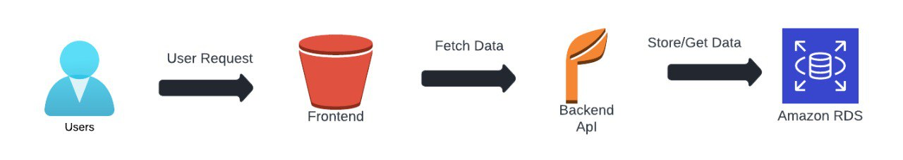

# Infrastructure:

# High-level overview of the infrastructure

## What is AWS?

AWS (Amazon Web Services) is a comprehensive, evolving cloud computing platform provided by Amazon that includes a mixture of infrastructure as a service (IaaS), platform as a service (PaaS) and packaged software as a service (SaaS) offerings. AWS services can offer an organization tools such as compute power, database storage and content delivery services.

AWS launched in 2006 from the internal infrastructure that Amazon.com built to handle its online retail operations. AWS was one of the first companies to introduce a pay-as-you-go cloud computing model that scales to provide users with compute, storage or throughput as needed.

AWS offers many different tools and solutions for enterprises and software developers that can be used in data centers in up to 190 countries. Groups such as government agencies, education institutions, nonprofits and private organizations can use AWS services.

## What is S3?

Amazon Simple Storage Service (Amazon S3) is an object storage service that offers industry-leading scalability, data availability, security, and performance. Customers of all sizes and industries can use Amazon S3 to store and protect any amount of data for a range of use cases, such as data lakes, websites, mobile applications, backup and restore, archive, enterprise applications, IoT devices, and big data analytics. Amazon S3 provides management features so that you can optimize, organize, and configure access to your data to meet your specific business, organizational, and compliance requirements.

## What is RDS?

Amazon Relational Database Service (or Amazon RDS) is a distributed relational database service by Amazon Web Services (AWS). It is a web service running "in the cloud" designed to simplify the setup, operation, and scaling of a relational database for use in applications. Administration processes like patching the database software, backing up databases and enabling point-in-time recovery are managed automatically. Scaling storage and compute resources can be performed by a single API call to the AWS control plane on-demand. AWS does not offer an SSH connection to the underlying virtual machine as part of the managed service.

## What is Elastic BeanStalk?

AWS Elastic Beanstalk is an easy-to-use service for deploying and scaling web applications and services developed with Java, .NET, PHP, Node.js, Python, Ruby, Go, and Docker on familiar servers such as Apache, Nginx, Passenger, and IIS.

You can simply upload your code and Elastic Beanstalk automatically handles the deployment, from capacity provisioning, load balancing, auto-scaling to application health monitoring. At the same time, you retain full control over the AWS resources powering your application and can access the underlying resources at any time.

There is no additional charge for Elastic Beanstalk - you pay only for the AWS resources needed to store and run your applications.