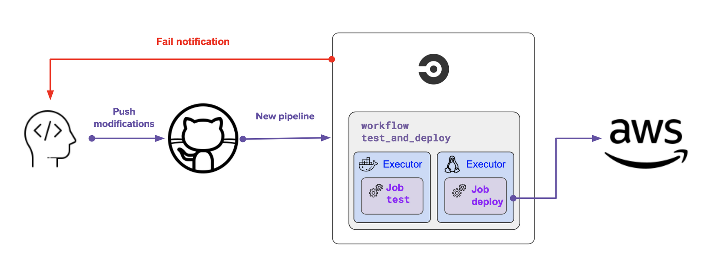
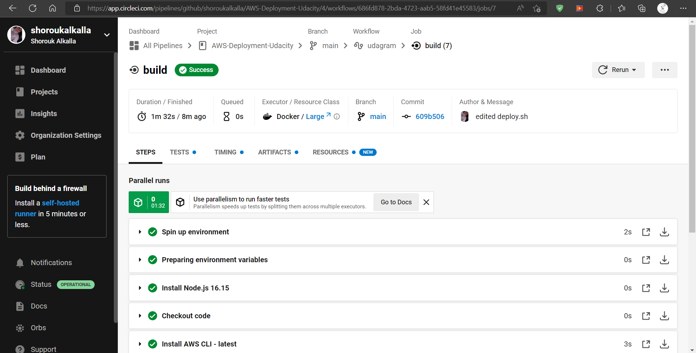
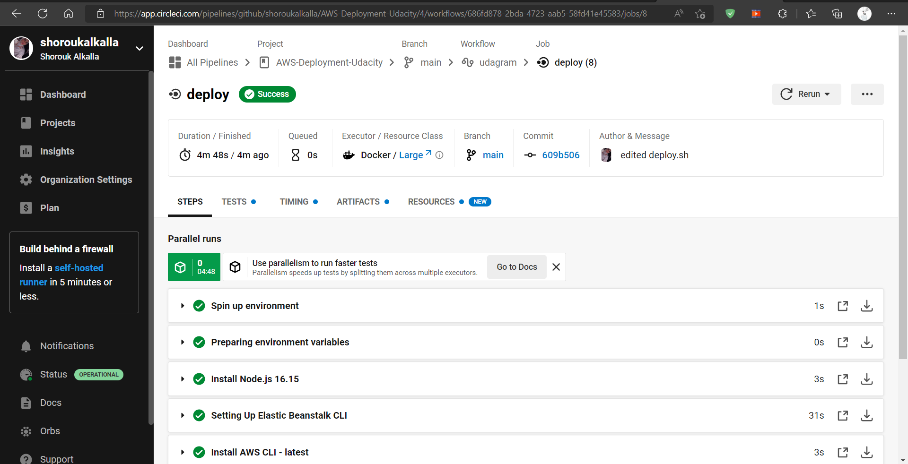

# CircleCI

## CircleCI Pipeline

Pipelines are normally written inside configuration files as a list of steps. In the case of CircleCI, this file will always be located inside a .circleci folder and will be named config.yml.

It contains the following:

-  **CircleCI version**: This is simply indicating which version of the platform our pipeline should use.
-  **Orbs** are a set of instructions created by CircleCi that allow us to _configure the pipeline_ on which we will run our actions. These instructions will instruct the server to setup specific software on the server executing our pipeline. We could use orbs to setup node.js or install the AWS CLI for example. Orbs _are not always present_ in a pipeline.
-  **Jobs** are groups of commands that we want to run. This is where we will run commands to _install, build or deploy our application_.
-  **Workflows** are instructions about _the order of the jobs_. They allow us to create complex flows and specify manual approvals. Workflows _are not always present_ in a pipeline.

## Pipeline

Pipelines are normally written inside configuration files as a list of steps. In the case of CircleCI, this file will always be located inside a .circleci folder and will be named `config.yml`.

1.  First of all, CircleCI configures the project based on `config.yml` and then starts the sequential workflow
2.  Build job

      

3.  Deploy Job

      

